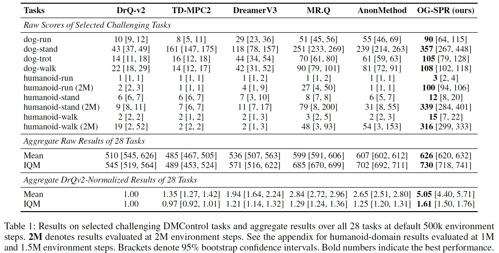
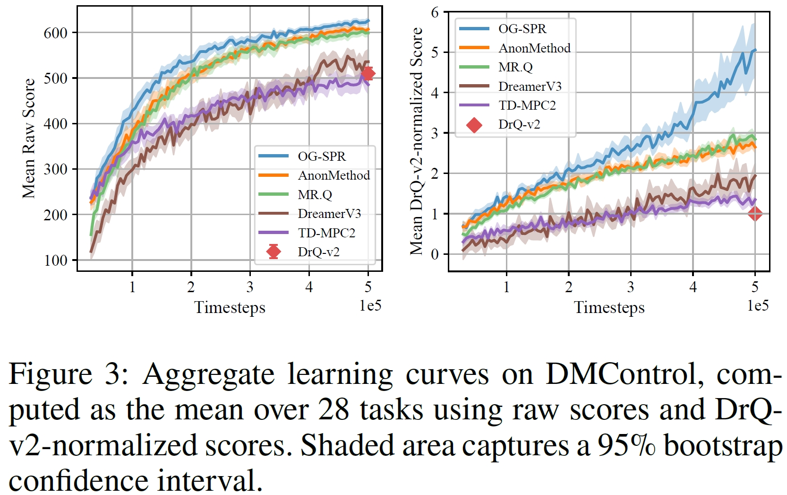

# OG-SPR
The repo for the paper Observation-Grounded Self-Predictive Reinforcement Learning for Visual Continuous Control.

OG-SPR is a method designed for visual reinforcement learning. It significantly outperforms state-of-the-art model-based RL methods, including **[DreamerV3](https://github.com/danijar/dreamerv3)** and **[TD-MPC2](https://github.com/nicklashansen/tdmpc2)**, as well as the model-free RL method **[MR.Q](https://github.com/facebookresearch/MRQ)**, on challenging robotic control tasks such as the Dog and Humanoid domains.





## Installation
We recommend creating a specific virtual environment for each benchmark to reduce the potential conflicts between dependencies.

### DeepMind Control suite (DMC)
```
cd OG_SPR
conda create -n dmc_env python=3.9
pip install -r ./dmc_requirements.txt
```

### Atari
```
cd OG_SPR
conda create -n atari_env python=3.9
pip install -r ./atari_requirements.txt
```

To ensure reproductivity, we also recommend creating virtual environments in the Docker image (vcwang/drqv2:1.5) provided by vcwang (https://hub.docker.com/r/vcwang/drqv2/tags) because this image already provides basic dependencies for configuring DMC (e.g., the EGL rendering mode).

## Algorithms
For each benchmark, we provide a specific script in the `algorithms` folder for training an agent while gathering evaluation records. The code style is similar to CleanRL (https://github.com/vwxyzjn/cleanrl). We hope this helps to understand our methods.

## Training
To run OG-SPR, please refer to the following examples:
```
# run on the DMC (walker-run)
nohup python -u /root/OG_SPR/algorithms/train_eval_dmc.py \
    --seed 42 \
    --domain "walker" \
    --task "run" \
    --log_root "/root/OG_SPR/results/dmc_visual"  \
    --exp_id "walker_run_dmc_visual_ogspr" \
    > /root/OG_SPR/walker_run_dmc_visual_ogspr.log 2>&1 &

# run on the Atari100k (Alien)
nohup python -u /root/OG_SPR/algorithms/train_eval_atari.py \
    --seed 42 \
    --env_id "AlienNoFrameskip-v4" \
    --log_root "/root/OG_SPR/results/atari" \
    --exp_id "Krull_atari_ogspr" \
    > /root/OG_SPR/Krull_atari_ogspr.log 2>&1 &
```

## Evaluation
We use TensorBoard to record evaluation results during training. Users can find the TensorBoard files in `log_writer_path` printed at the top of the content in the log file (e.g., `/root/OG_SPR/Krull_atari_ogspr.log`). Below is a usage example of TensorBoard:
```
tensorboard --logdir {log_writer_path} --port 6006
```


